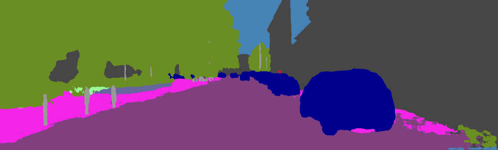

# KITTI DeepLab
Inference script and frozen inference graph with fine tuned weights for semantic segmentation on images from the KITTI dataset with TensorFlow. While the weights provided by the authors reach an mIoU of 44% on the validation set, the fine-tuned weights reach an mIoU of 72.73 %.

## Example output
##### Original image

  

##### Segmentation Result with original graph

  

##### Segmentation Result with fine-tuned graph

  

## Getting Started

CLone the repository:
`git clone https://github.com/hiwad-aziz/kitti_deeplab.git`

Download the frozen inference graph:
`wget --no-check-certificate -r 'https://docs.google.com/uc?export=download&id=1ynVTP5CjMui2J3j2JLJDii8oC0ef_WpL' -O frozen_inference_graph.zip`

Run the script:
`python inference.py path_to_frozen_inference_graph.pb path_to_image_folder/` 

## References
##### DeepLab
https://github.com/tensorflow/models/tree/master/research/deeplab
##### KITTI dataset
http://www.cvlibs.net/datasets/kitti/